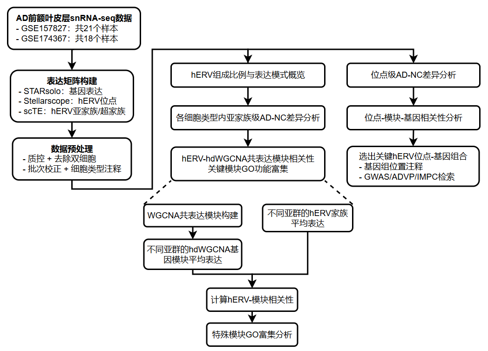

# 本科毕业论文

## 基因组内源性逆转录病毒在阿尔茨海默症中的重调与机制研究 

**Study on the Profile and Mechanism of Human Endogenous Retroviruses in Alzheimer's Disease**

### 摘要

**研究背景**：
- 阿尔茨海默症（AD）是一种常见的神经退行性疾病，其发生发展与Aβ沉积、Tau病理、神经炎症、突触功能损伤和胶质细胞状态改变等多种因素有关
- 近年来，单核转录组研究发现，AD脑组织中的分子变化具有明显的细胞类型特异性；同时，越来越多研究提示，非编码区域和重复序列可能参与AD相关基因调控和炎症反应
- 人类内源性逆转录病毒（hERV）是人类基因组中重要的重复序列，约占基因组的8%。已有研究表明，hERV可作为调控元件影响宿主基因表达，也可能通过RNA或病毒样蛋白产物激活先天免疫通路
- 当前对于AD中hERV的研究仍相对有限，尤其缺少在细胞类型水平下对hERV表达特征及其相关细胞状态的系统分析

**研究内容**：基于AD前额叶皮层单核RNA测序数据，采用EM算法重分配多重比对读段的策略，描绘了不同脑细胞类型中hERV家族及位点水平的表达变化趋势，并解析了对应的AD疾病相关功能基因

**研究结果**：
- AD脑组织中的hERV变化表现出显著的细胞类型和家族/位点特异性：小胶质细胞中的HERVH、HERVL和HERVK9等家族的高表达与免疫激活和抗病毒样反应相关，兴奋性神经元中的HERVL、HERVK9和HERVK等家族的高表达与突触功能下降相关，少突胶质细胞和星形胶质细胞中的HERV3、HERVL、HERVK11等家族的高表达与膜结构调节、胶质支持和细胞通讯等状态相关
- 部分hERV位点与一些AD相关基因与机制具有细胞特异性显著相关，例如HERVW家族的HERVW-15q21.2位于GLDN基因内部，并在少突胶质细胞中与GLDN呈正相关，而GLDN在ADVP等数据库中具有AD及相关痴呆风险记录
- 总的来说，本文从hERV亚家族和位点层面初步探明了hERV在AD中细胞类型特异的重调趋势及潜在的疾病相关基因，为后续系统性鉴定AD相关hERV诊疗标志物、挖掘新型疾病机制提供了前期基础

### 数据和工具

**数据集**：
- [GSE157827](https://www.ncbi.nlm.nih.gov/geo/query/acc.cgi?acc=GSE157827)：snRNA-seq，前额皮层(prefrontal cortex)，样本量21个，使用10X Genomics，来自[《Single-nucleus transcriptome analysis reveals dysregulation of angiogenic endothelial cells and neuroprotective glia in Alzheimer’s disease》](https://www.pnas.org/doi/full/10.1073/pnas.2008762117)，[每个样本的具体信息](https://www.pnas.org/doi/suppl/10.1073/pnas.2008762117/suppl_file/pnas.2008762117.sd01.xlsx)
- [GSE174367](https://www.ncbi.nlm.nih.gov/geo/query/acc.cgi?acc=GSE174367)：snATAC-seq/snRNA-seq以及bulk RNA-seq，此项目中只使用了其中snRNA-seq的数据，样本量19个（根据论文作者，使用其中18个质量较好的样本），使用10x Genomics V3，前额皮层(prefrontal cortex)，来自[《Single-nucleus chromatin accessibility and transcriptomic characterization of Alzheimer’s disease》](https://www.nature.com/articles/s41588-021-00894-z)，[每个样本的具体信息](https://static-content.springer.com/esm/art%3A10.1038%2Fs41588-021-00894-z/MediaObjects/41588_2021_894_MOESM4_ESM.xlsx)

**主要使用的软件**：
- 数据集下载：`parallel-fastq-dump`
- 序列比对：`STAR`
- hERV计数：`stellarscope`（位点级）、`scTE`（家族级）
- 单细胞组学分析：`Seurat`、`scDblFinder`（去除双细胞）、`harmony`（数据集整合）、`MAST`（差异表达分析）
- 共表达网络：`hdWGCNA`
- GO分析：`clusterProfiler`/`org.Hs.eg.db`
- 画图：`ggplot2`、`pheatmap`（热图）、`patchwork`/`cowplot`（拼图）、`pyGenomeTracks`（基因组位置注释图）

### 研究流程

